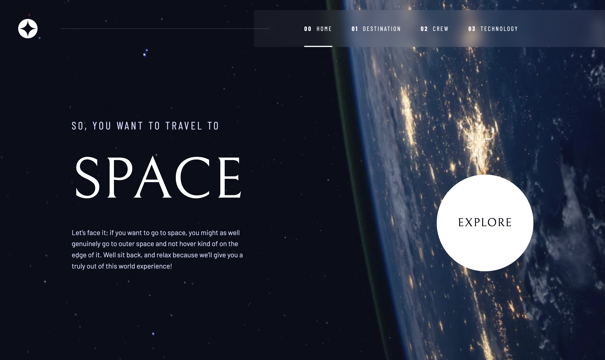

# Frontend Mentor - Space tourism website

This is a solution to the [Space tourism website challenge on Frontend Mentor](https://www.frontendmentor.io/challenges/space-tourism-multipage-website-gRWj1URZ3). Frontend Mentor challenges help you improve your coding skills by building realistic projects.

## Table of contents

- [Overview](#overview)
  - [The challenge](#the-challenge)
  - [Screenshot](#screenshot)
  - [Links](#links)
- [My process](#my-process)
  - [Built with](#built-with)
  - [What I learned](#what-i-learned)
  - [Continued development](#continued-development)
  - [Useful resources](#useful-resources)
- [Author](#author)

## Overview

### The challenge

Users should be able to:

- View the optimal layout for each of the website's pages depending on their device's screen size
- See hover states for all interactive elements on the page
- View each page and be able to toggle between the tabs to see new information

### Screenshot



### Links

- Solution URL: [Solution page on Frontend Mentor](https://www.frontendmentor.io/solutions/space-tourism-multipage-website-VQ92XiN1lh)
- Live Site URL (Original ver.): [Live site on Netlify](https://space-tourism-yishin.netlify.app/)
- Live Site URL (React ver.): [Live site on Netlify](https://space-tourism-react-yishin.netlify.app/)

## My process

### Built with

#### Original ver.

- Desktop-first workflow
- Semantic HTML5 markup
- JavaScript ES6+
- SCSS - CSS preprocessor
- Parcel - build tool for the web

#### React ver.

- [React](https://react.dev/) - JS library
- [React-Router](https://reactrouter.com/) - JS library

### What I learned

- I want the mobile users can slide the screen to change the present content when they watch the crew page. It is a very good solution which I found on stackoverflow! But the defect of it is that, it sometimes trigger the nextSlide/prevSlide function when user slide down or up. To improve the user experience, I do some change on if statement.

  ```js
  let touchstartX = 0;
  let touchendX = 0;

  function checkDirection() {
    // original solution
    if (touchendX < touchstartX) nextSlide();
    else if (touchendX > touchstartX) prevSlide();

    // new solution
    if (touchendX - touchstartX < -50) nextSlide();
    else if (touchendX - touchstartX > 50) prevSlide();
  }

  document.addEventListener("touchstart", (e) => {
    touchstartX = e.changedTouches[0].screenX;
  });

  document.addEventListener("touchend", (e) => {
    touchendX = e.changedTouches[0].screenX;
    checkDirection();
  });
  ```

### Continued development

- Build up multiple pages website with many html file make folder looks very messy.
  Refactoring with link and route components of React may be a better solution.

### Useful resources

- [Perfect Full Page Background Image](https://css-tricks.com/perfect-full-page-background-image/) - At beginning, I am vexed by the problem of how to make background image to fill all window without any bug. This site helped me a lots and provide many method to approach full screen background image.

## Author

- Website - [Yi-Shin Jheng](https://github.com/Yishin-Jheng)
- Frontend Mentor - [@Yishin-Jheng](https://www.frontendmentor.io/profile/Yishin-Jheng)
